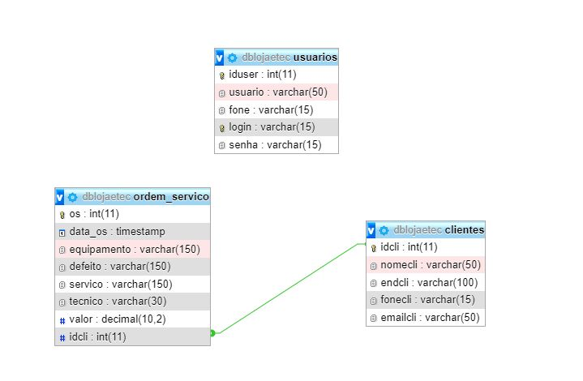

<h1 align="center">Projeto CRUD com Java e MySQL</h1>

Utilizando a IDE do NetBeans, faremos uma conexão entre o banco de Dados MySQL com a Aplicação Web feita utilizando Java

 

 <a href="#objetivo">Objetivo</a> •
 <a href="#bancoDeDados">Banco de Dados</a> • 
 <a href="#tecnologias">Tecnologias</a> • 
 <a href="#contribuicao">Contribuição</a> • 
 <a href="#licenc-a">Licença</a> • 
 <a href="#autor">Autor</a>

<h2 align="center" id="#objetivo">Objetivo</h2>

Criar uma aplicação Web para sintetizar os conteúdos propostos na decorrência do curso.

<h2 align="center" id="#bancoDeDados">Banco de Dados</h2>

Utilizando o Xampp, o MYSQL foi o banco de dados escolhido!

<h4 align="center"> Desenhadores do SQL para vermos os relacionamentos </h4>

	

 
<h4 align="center"> 
	🚧 CRUD Em construção...  🚧
</h4>
